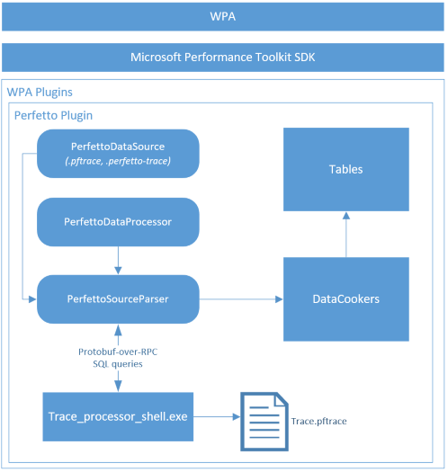
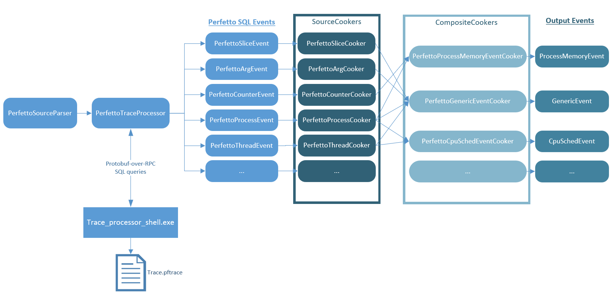

# Perfetto Plugin architecture

The WPA Perfetto plugin follows the standard Microsoft Performance Toolkit SDK [architecture](https://github.com/microsoft/microsoft-performance-toolkit-sdk/tree/main/documentation/Architecture)

Here is a closer look at the bottom half of that diagram, the data cooking pipeline:

PerfettoSourceParser will start the trace_processor_shell.exe process and load the Perfetto trace file. Trace_processor_shell will process the trace file and will load all the trace data into SQL tables (such as slice, process, thread). SQL Queries will be made over HTTP/RPC with Protobuf objects. One query will be made per SQL table. Each query will produce events of the corresponding type (PerfettoSliceEvent). 

Source cookers are registered to receive their own specific events and will process and store them as soon as they are created. Composite cookers are registered to receive events from a specific set of source cookers and they will query those source cookers once they all have finished their processing. Composite cookers will create the final output events, which can then be used by the client (such as WPA).

For example, for the slice table, the process goes like this:

1. Perform a SQL query into the Perfetto trace through trace_processor_shell.exe ("select * from slice"). This returns a QueryResult protobuf object. The QueryResult object is parsed and objects of type PerfettoSliceEvent are returned. One event for each row in the SQL table.
2. PerfettoSliceCooker will process/store all the PerfettoSliceEvents as they are created.
3. Once all the other tables have also finished, PerfettoGenericEventCooker will gather all the events from each cooker and do a join on them to create complete PerfettoGenericEvent objects.

## Rationale

The reason for performing individual queries of each table through trace_processor_shell.exe is due to performance. In order to display useful output data like GenericEvent charts or CPU scheduler view, we need data from multiple tables. Performing those multi-table queries over trace_processor_shell.exe proved to be slower than performing those multi-table queries in C# with LINQ.

## Trace Processor Shell
Trace_processor_shell.exe is built from the [Perfetto GitHub repo](https://github.com/google/perfetto). To build this for Windows, follow the instructions from their [documentation](https://perfetto.dev/docs/contributing/build-instructions#building-on-windows). Prebuilt binaries can also be found in their [releases](https://github.com/google/perfetto/releases/).

